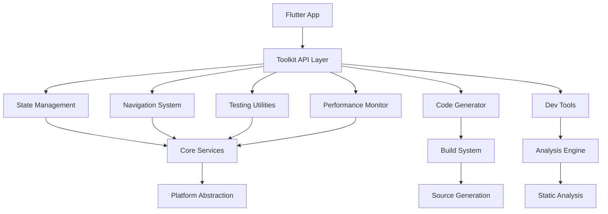

# Flutter Developer Productivity Toolkit - Design Document

## Overview

The Flutter Developer Productivity Toolkit is a comprehensive package that addresses the most critical pain points identified in the Flutter developer community. The toolkit provides a unified, opinionated approach to common development challenges while maintaining flexibility and performance. The architecture follows a modular design where each component can be used independently or as part of the integrated system.

The toolkit consists of six core modules:
1. **State Management** - Reactive state with automatic lifecycle management
2. **Navigation System** - Declarative routing with type-safe deep linking
3. **Testing Utilities** - Comprehensive testing framework with minimal setup
4. **Performance Monitoring** - Real-time development performance analysis
5. **Code Generation** - Automated boilerplate reduction using build_runner
6. **Development Tools** - Integrated workflow optimization and pub.dev utilities

## Architecture

The toolkit follows a layered architecture with clear separation of concerns:



### Core Principles

1. **Zero Configuration**: Works out of the box with sensible defaults
2. **Incremental Adoption**: Each module can be adopted independently
3. **Type Safety**: Leverages Dart's type system for compile-time guarantees
4. **Performance First**: Minimal runtime overhead with development-time optimizations
5. **Developer Experience**: Prioritizes ease of use and clear error messages

## Components and Interfaces

### State Management Component

**Core Interface:**
```dart
abstract class StateManager<T> {
  T get state;
  Stream<T> get stream;
  void update(T Function(T current) updater);
  void dispose();
}

abstract class StateProvider {
  T provide<T extends StateManager>();
  void register<T extends StateManager>(T manager);
}
```

**Key Features:**
- Automatic dependency injection with lifecycle management
- Reactive updates with minimal widget rebuilds
- Built-in persistence with configurable storage backends
- Development-time state debugging and time-travel

### Navigation System Component

**Core Interface:**
```dart
abstract class RouteBuilder {
  void defineRoute<T>(String path, Widget Function(T params) builder);
  Future<R?> navigate<T, R>(String path, {T? params});
  void registerDeepLinkHandler(String pattern, RouteHandler handler);
}

abstract class NavigationStack {
  void push(Route route);
  void pop<T>([T? result]);
  void pushReplacement(Route route);
  List<Route> get history;
}
```

**Key Features:**
- Annotation-based route generation with build_runner
- Type-safe parameter passing and result handling
- Automatic deep link parsing and validation
- Multiple navigation stack support for complex UIs

### Testing Utilities Component

**Core Interface:**
```dart
abstract class TestHelper {
  Widget wrapWithProviders(Widget child, {List<Provider>? providers});
  Future<void> pumpAndSettle(WidgetTester tester, Widget widget);
  MockStateManager<T> createMockState<T>();
}

abstract class TestDataFactory {
  T create<T>({Map<String, dynamic>? overrides});
  List<T> createList<T>(int count, {Map<String, dynamic>? baseData});
}
```

**Key Features:**
- Pre-configured test environments with common dependencies
- Automatic mock generation for state managers and services
- Integration test utilities with app lifecycle management
- Realistic test data generation with customizable factories

### Performance Monitor Component

**Core Interface:**
```dart
abstract class PerformanceMonitor {
  void startMonitoring();
  void stopMonitoring();
  Stream<PerformanceMetrics> get metricsStream;
  void reportCustomMetric(String name, double value);
}

class PerformanceMetrics {
  final int frameDrops;
  final double memoryUsage;
  final Map<String, int> widgetRebuildCounts;
  final List<PerformanceWarning> warnings;
}
```

**Key Features:**
- Real-time widget rebuild tracking with visual indicators
- Memory leak detection with actionable recommendations
- Frame drop analysis with bottleneck identification
- Custom performance metric collection and reporting

### Code Generation Component

**Core Interface:**
```dart
abstract class CodeGenerator extends Builder {
  Future<void> generateStateManagers(BuildStep buildStep);
  Future<void> generateRoutes(BuildStep buildStep);
  Future<void> generateDataModels(BuildStep buildStep);
}

// Annotations for code generation
class GenerateState {
  final bool persist;
  final String? storageKey;
  const GenerateState({this.persist = false, this.storageKey});
}

class GenerateRoute {
  final String path;
  final bool requiresAuth;
  const GenerateRoute(this.path, {this.requiresAuth = false});
}
```

**Key Features:**
- Automatic state manager generation from class annotations
- Type-safe route generation with parameter validation
- Data model generation with serialization methods
- API client generation from OpenAPI specifications

## Data Models

### State Management Models

```dart
class StateConfiguration {
  final bool enablePersistence;
  final String? storageKey;
  final Duration? cacheTimeout;
  final bool enableDebugging;
}

class StateTransition<T> {
  final T previousState;
  final T newState;
  final DateTime timestamp;
  final String? action;
}
```

### Navigation Models

```dart
class RouteDefinition {
  final String path;
  final Type parameterType;
  final Type returnType;
  final bool requiresAuthentication;
  final List<RouteGuard> guards;
}

class DeepLinkConfiguration {
  final String scheme;
  final String host;
  final Map<String, String> pathPatterns;
}
```

### Performance Models

```dart
class WidgetPerformanceData {
  final String widgetType;
  final int rebuildCount;
  final Duration averageBuildTime;
  final double memoryFootprint;
}

class PerformanceWarning {
  final WarningType type;
  final String message;
  final String? suggestion;
  final WidgetLocation? location;
}
```

## Correctness Properties

*A property is a characteristic or behavior that should hold true across all valid executions of a system-essentially, a formal statement about what the system should do. Properties serve as the bridge between human-readable specifications and machine-verifiable correctness guarantees.*

### Property Reflection

After analyzing all acceptance criteria from the requirements document, I identified several areas where properties could be consolidated:

**Redundancy Analysis:**
- State management properties around automatic generation and lifecycle can be combined into comprehensive state consistency properties
- Navigation properties for parameter validation and deep linking can be unified into routing correctness properties  
- Testing utilities properties for mock creation and environment setup can be consolidated into test reliability properties
- Performance monitoring properties for different metric types can be combined into monitoring accuracy properties
- Code generation properties for different output types can be unified into generation correctness properties

**Consolidated Properties:**
The following properties eliminate redundancy while maintaining comprehensive validation coverage:

### Property 1: State consistency preservation
*For any* state manager and any sequence of state updates, the final state should be deterministic and all subscribers should receive consistent state notifications
**Validates: Requirements 1.1, 1.2, 1.3**

### Property 2: State persistence round trip
*For any* persistable state object, saving then loading should produce an equivalent state with identical behavior
**Validates: Requirements 1.4**

### Property 3: Navigation parameter type safety
*For any* route definition with typed parameters, navigation should only succeed with correctly typed arguments and fail gracefully with type mismatches
**Validates: Requirements 2.1, 2.4**

### Property 4: Deep link parsing consistency
*For any* valid deep link URL, parsing then reconstructing should produce an equivalent URL that navigates to the same destination
**Validates: Requirements 2.2**

### Property 5: Navigation history preservation
*For any* sequence of navigation operations, the navigation stack should maintain correct history and support proper back navigation
**Validates: Requirements 2.3, 2.5**

### Property 6: Test environment isolation
*For any* test execution, the test environment should be completely isolated with no state leakage between test runs
**Validates: Requirements 3.1, 3.3**

### Property 7: Mock state behavioral consistency
*For any* mock state manager, it should behave identically to real state managers for all common operations
**Validates: Requirements 3.2**

### Property 8: Test data factory determinism
*For any* test data factory configuration, generating data with identical parameters should produce equivalent objects
**Validates: Requirements 3.5**

### Property 9: Performance metric accuracy
*For any* performance monitoring session, reported metrics should accurately reflect actual application performance within acceptable tolerances
**Validates: Requirements 4.1, 4.2, 4.3**

### Property 10: Performance recommendation relevance
*For any* detected performance issue, generated recommendations should be applicable and lead to measurable improvements
**Validates: Requirements 4.4, 4.5**

### Property 11: Code generation output correctness
*For any* annotated source code, generated code should compile successfully and maintain behavioral equivalence with manual implementations
**Validates: Requirements 5.1, 5.2, 5.3, 5.4**

### Property 12: Generated code serialization round trip
*For any* generated data model, serializing then deserializing should produce an equivalent object
**Validates: Requirements 5.5**

### Property 13: Package metadata completeness
*For any* package analyzed by the optimizer, all required metadata fields should be present and valid according to pub.dev standards
**Validates: Requirements 6.1, 6.2**

### Property 14: Documentation coverage verification
*For any* public API in a package, documentation should exist and provide sufficient information for proper usage
**Validates: Requirements 6.3**

### Property 15: Development tool configuration consistency
*For any* project configuration change, all related configuration files should remain consistent and valid
**Validates: Requirements 7.3, 7.5**

### Property 16: Error message actionability
*For any* runtime error detected by the toolkit, the enhanced error message should provide specific, actionable steps for resolution
**Validates: Requirements 8.1, 8.4**

### Property 17: Debug state timeline consistency
*For any* sequence of state changes during debugging, the timeline should accurately represent the actual state transitions with proper ordering
**Validates: Requirements 8.5**

## Error Handling

The toolkit implements a comprehensive error handling strategy:

### Error Categories

1. **Configuration Errors**: Invalid setup or missing dependencies
2. **Runtime Errors**: State management failures, navigation issues
3. **Generation Errors**: Code generation failures or invalid annotations
4. **Performance Errors**: Memory leaks, excessive rebuilds
5. **Testing Errors**: Test setup failures, mock configuration issues

### Error Recovery Strategies

- **Graceful Degradation**: Core functionality continues even if optional features fail
- **Automatic Retry**: Transient failures are automatically retried with exponential backoff
- **Fallback Mechanisms**: Alternative implementations for critical features
- **Developer Guidance**: Clear error messages with suggested solutions

### Error Reporting

```dart
class ToolkitError extends Error {
  final ErrorCategory category;
  final String message;
  final String? suggestion;
  final StackTrace? originalStackTrace;
  final Map<String, dynamic>? context;
}

abstract class ErrorReporter {
  void reportError(ToolkitError error);
  void reportWarning(String message, {String? suggestion});
  Stream<ToolkitError> get errorStream;
}
```

## Testing Strategy

The testing strategy employs both unit testing and property-based testing to ensure comprehensive coverage and correctness validation.

### Unit Testing Approach

Unit tests focus on:
- **Component Integration**: Testing how different modules work together
- **Edge Cases**: Boundary conditions and error scenarios  
- **API Contracts**: Ensuring interfaces behave as documented
- **Platform Compatibility**: Testing across different Flutter versions and platforms

Key unit testing areas:
- State manager lifecycle and dependency injection
- Route parsing and navigation stack management
- Code generation output validation
- Performance metric calculation accuracy
- Error handling and recovery mechanisms

### Property-Based Testing Approach

Property-based testing will use the **test** package with **faker** for data generation, configured to run a minimum of 100 iterations per property test. Each property-based test will be tagged with a comment explicitly referencing the correctness property from this design document using the format: **Feature: flutter-dev-toolkit, Property {number}: {property_text}**

Property tests verify:
- **Universal Behaviors**: Properties that should hold across all valid inputs
- **Invariant Preservation**: Ensuring system invariants are maintained through operations
- **Round-trip Consistency**: Serialization, navigation, and state persistence correctness
- **Type Safety**: Compile-time and runtime type correctness
- **Performance Characteristics**: Ensuring performance properties hold under various loads

Each correctness property will be implemented by a single property-based test that generates diverse test cases to validate the universal behavior described in the property statement.

### Testing Infrastructure

- **Automated Test Generation**: Generate tests from annotations and specifications
- **Mock Factories**: Comprehensive mock objects for all major components
- **Test Data Builders**: Realistic test data generation with customizable parameters
- **Integration Test Helpers**: Simplified setup for full app testing scenarios
- **Performance Test Utilities**: Benchmarking and performance regression detection